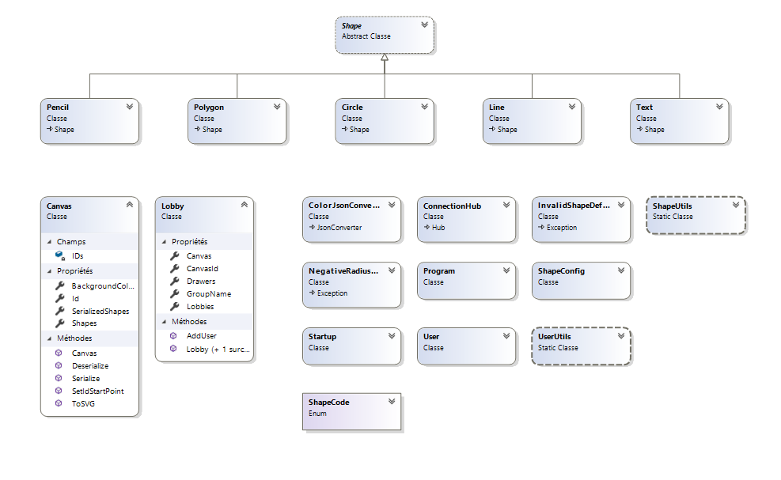

# Whiteboard Colaboratif, projet csharp-08    

## Table des matières

1) [Introduction](#introduction)
2) [Mise en place du projet](#mise-en-place-du-projet)
3) [Fonctionnalitées](#fonctionnalitees)
4) [Choix techniques](#choix-techniques)
5) [Diagramme de classes](#diagramme-de-classes)

## Introduction

Ce projet fait parti du cours de POOA :
Nous avons réalisé un whiteboard collaboratif qui fonctionne en application WEB : application consituée d'un backend en c# et d'un client javascript (VueJS) (déjà compilé dans le dossier statique ./wwwroot pour la version du projet dans le .zip).

## Mise en place du projet

### À partir du zip
Pour démarrer le projet, il suffit de l'ouvrir avec un IDE C# (idéalement Visual Studio) et de lancer le programme.

Ensuite, l'application devrait se trouver à l'addresse: [localhost:5001](https://locahost:5001)

### Depuis zéro
#### Serveur
Pour démarrer le serveur, ouvrir [le projet](https://github.com/csharp-08/csharp-08) dans visual studio et lancer le programme.
Le serveur va alors écouter en https sur le port 5001.

#### Client
Il faut alors lancer le client VueJS. Premièrement, télécharger [le projet](https://github.com/csharp-08/client).

Créer ensuite un fichier .env contenant la ligne suivante:
```
VUE_APP_BASE_URL=https://localhost:5001
```

Ensuite exécuter:
```
yarn install
yarn serve
```

Le client est alors accessible à l'adresse https://localhost:8080

## Fonctionnalitées

// TODO

## Choix techniques

Le serveur (backend) est en C#, language de programmation du cours.
Le client (frontend) est en javascript et utilise le framework VueJS. Ce choix a été fait pour des raisons d'expérience et d'affinités.

On utilise des websockets pour la communication entre les clients et le serveur. La raison principale est le besoin d'envoyer des messages du serveur vers les clients et le websocket et parfait pour ça.

Enfin, nous avons décidé d'utiliser la librairie [SignalR](https://dotnet.microsoft.com/apps/aspnet/signalr) développée par Microsoft pour implémenter les websockets a la fois coté serveur et coté client. Cette librairie nous permet de ne pas réinventer la roue et d'accélerer le développement de nos fonctionnalitées souhaitées.   

## Diagramme de classes

