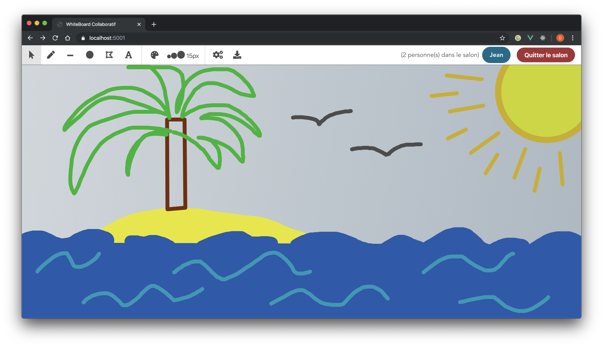

# Whiteboard Colaboratif, projet csharp-08    

## Table des matières

1) [Introduction](#introduction)
2) [Mise en place du projet](#mise-en-place-du-projet)
3) [Fonctionnalitées](#fonctionnalitees)
4) [Choix techniques](#choix-techniques)
5) [Diagramme de classes](#diagramme-de-classes)
5) [Aperçu](#aperçu)

## Introduction

Ce projet fait parti du cours de POOA :
Nous avons réalisé un whiteboard collaboratif qui fonctionne en application WEB : application consituée d'un backend en c# et d'un client javascript (VueJS) (déjà compilé dans le dossier statique ./wwwroot pour la version du projet dans le .zip).

## Mise en place du projet
### Packages nugget
Voici la liste des packets nuggets qui sont nécessaires pour le fonctionnement du projet. Ils sont normalement installés au lancement de la solution par visual studio.
```
Microsoft.AspNetCore.App
Microsoft.AspNetCore.Razor.Design
Newtonsoft.Json
sqlite-net-pcl
System.Data.SQLite
```

### À partir du zip
Pour démarrer le projet, il suffit de l'ouvrir avec un IDE C# (idéalement Visual Studio) et de lancer le programme.

Ensuite, l'application devrait se trouver à l'addresse: [localhost:5001](https://locahost:5001)

### Depuis zéro
#### Serveur
Pour démarrer le serveur, ouvrir [le projet](https://github.com/csharp-08/csharp-08) dans visual studio et lancer le programme.
Le serveur va alors écouter en https sur le port 5001.

#### Client
Il faut alors lancer le client VueJS. Premièrement, télécharger [le projet](https://github.com/csharp-08/client).

Créer ensuite un fichier .env contenant la ligne suivante:
```
VUE_APP_BASE_URL=https://localhost:5001
```

Ensuite exécuter:
```
yarn install
yarn serve
```

Le client est alors accessible à l'adresse http://localhost:8080.

## Fonctionnalitées

-  Connexion au Dashboard
   - Création d'un salon de dessin.
   - Connexion et déconnexion d'un salon existant à partir du nom du salon.
   - Connection automatique à la session précédente.
   - Choix d'un nom d'utilisateur.
   - Gestion des problèmes de connexion.
   - Liste des utilisateurs connectés accessibles en survolant le nom d'utilisateur dans la barre d'édition.
- Dessin de formes
   - Dessin de différentes formes géométriques (Ligne, cercle, polygone, ...)
   - Écriture de texte et tracé libre possible.
   - Choix de l'épaisseur de trait, de la couleur, et de nombreux paramètres de styles pour les objets dessinés.
   - Possibilité de modifier et déplacer les formes grace à un panneau de configuration apparaissant quand on sélectionne une forme.
   - Synchronisation en temps réel des formes dessinées ou supprimées avec les autres membres du salon.
   - Changement de la couleur de fond possible depuis l'onglet paramètres, avertissement original du changement aux autres utilisateurs.
- Gestion des permissions
   - possibilité d'autoriser l'édition et la supression des formes de l'utilisateur depuis l'onglet Paramètres.
   - Gestion des permissions au niveau des objets dessinés.
- Sauvegarde du travail
   - Possibilité d'exporter le travail aux formats SVG ou PNG!
   - Suppression automatique des salons non utilisés après un certain délai.
   - Persistance des dessins des salons dans la base de données locale du serveur.

## Points d'amélioration

- Duplication des objets.
- Déplacement des objets avec les flèches du clavier.
- Gestion de la superpositions des objets.
- Ajout d'images

## Scénario de test
Voici un petit scénario utilisateur pour tester le projet.

1. Lancer le projet (via Visual Studio)
2. Dans un navigateur web, rentrer l'adresse suivante: https://localhost:5001
3. Sur l'écran de connexion, rentrer un nom d'utilisateur et laisser le champs "Nom du salon" à default. Cliquer sur "Commencer"
4. Une fois rentré dans le salon, dessiner diverses formes (ligne libre, ligne droite, cerle, polygone, texte). Ne pas hésiter à changer la couleur des formes ainsi que leur position
5. Une fois les formes dessinées, couper l'exécution du programme puis la relancer
6. Recharger la page wbe du client -> la connexion au salon devrait être automatique, et les formes précédemment dessinées devraient être toujours présentes.
7. Enfin, cliquer sur le bouton d'export (le plus à droite de la barre d'outils) et exporter le canvas en PNG ou SVG

## Choix techniques

Le serveur (backend) est en C#, language de programmation du cours.
Le client (frontend) est en javascript et utilise le framework VueJS. Ce choix a été fait pour des raisons d'expérience et d'affinités.

On utilise des websockets pour la communication entre les clients et le serveur. La raison principale est le besoin d'envoyer des messages du serveur vers les clients et le websocket et parfait pour ça.

Le serveur est entièrement résistant au redémarrage. Ainsi, tous les utilisateurs, salons et canvas sont sauvegardés dans une base de donnée SQLite et sont restaurés au lancement de l'application.

Enfin, nous avons décidé d'utiliser la librairie [SignalR](https://dotnet.microsoft.com/apps/aspnet/signalr) développée par Microsoft pour implémenter les websockets à la fois coté serveur et coté client. Cette librairie nous permet de ne pas réinventer la roue et d'accélerer le développement des fonctionnalitées souhaitées.   

## Diagramme de classes


## Aperçu


